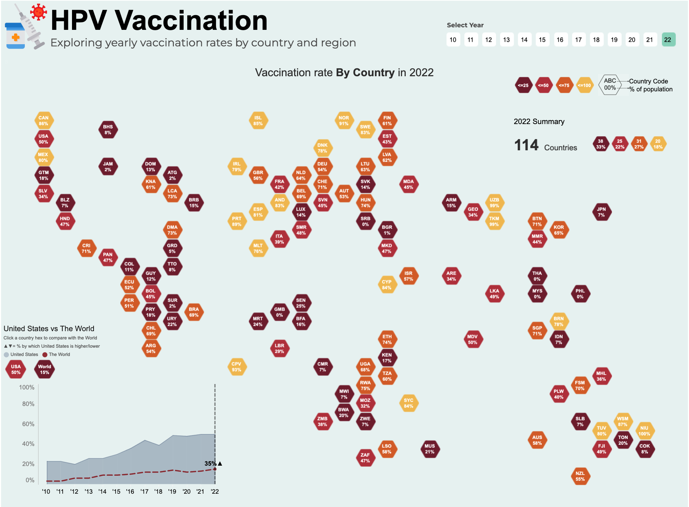

# Eliminating Cervical Cancer: HPV Vaccination Dashboard  

  

## Overview  
This project visualizes global HPV vaccination rates from 2010 to 2023, highlighting trends, regional disparities, and progress toward eliminating cervical cancer. The dashboard emphasizes the critical role of HPV vaccination in saving lives and identifies areas needing urgent action.  

## Features  
- **Yearly Trends:** Visualize vaccination rates globally over time.  
- **Geographical Analysis:** Explore vaccination rates using a hex map.  
- **Progress vs. Target:** Compare actual rates to WHO targets for cervical cancer elimination.  
- **Interactive Filters:** Analyze data by region, country, and year.  

## Files Included  
- ** Primary dataset with vaccination percentages from 2010 to 2023.  
- ** Dataset for creating the hex map visualization.  
- ** Snapshot of the Tableau dashboard.  
- ** Tableau workbook file.  

## Tableau Public Link  
[View the Dashboard on Tableau Public](https://public.tableau.com/shared/FPD7MTN8G?:display_count=n&:origin=viz_share_link)  
